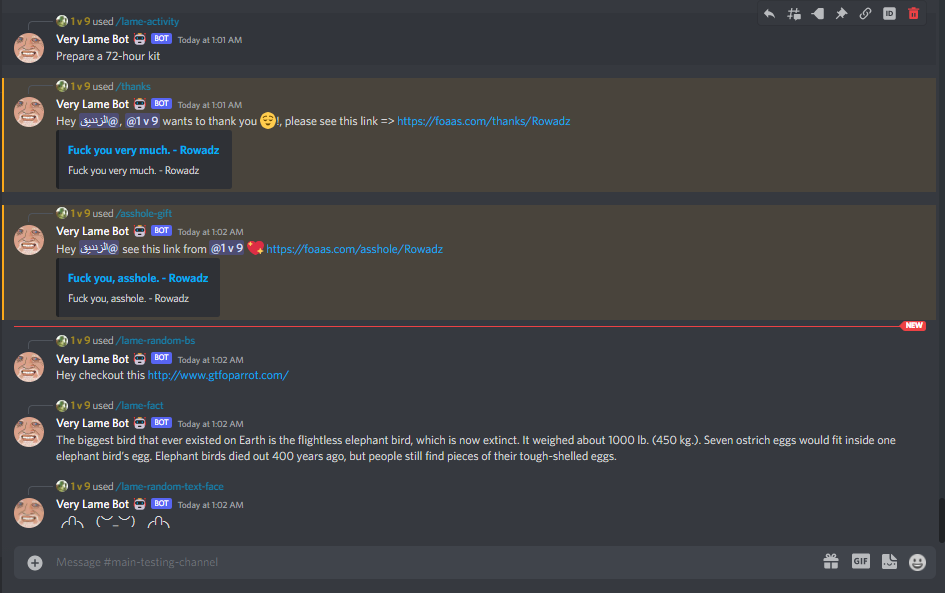

# Discord Lame BOT 🤖

This bot 🤖 just sends some lame jokes and roasts anyone in the server.

# How to install locally

> you need node 14+

```bash
$ git@github.com:MohammedAl-Rowad/discord-lame-bot.git
$ cd discord-lame-bot
$ yarn
```

# How to run it locally

- Start reading from here
  - [Setting up a bot application](https://discordjs.guide/preparations/setting-up-a-bot-application.html#creating-your-bot)
- Invite the bot into your server
- `yarn dev:watch`

# Code style

This repo uses [husky](https://github.com/typicode/husky), [eslint](https://eslint.org/) and [prettier](https://prettier.io/) to format the code when you commit.

# Tokens and Secrets

Rename the `.env.example` to `.env`

# Screenshots


